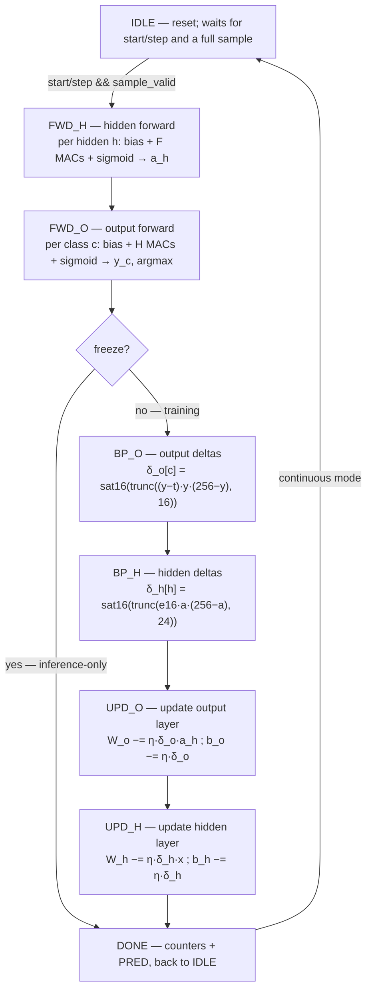
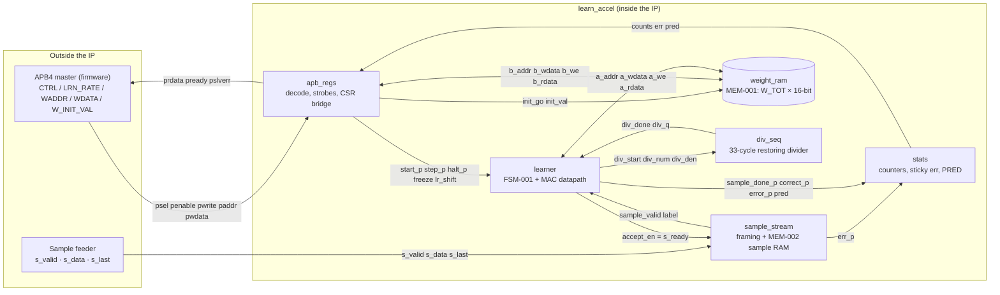

# rinriAI — Project & RTL Learning Guide

> A guided tour of the rinriAI (PRJ-005) learning accelerator, written 2026-08-22.
> It explains **what** the hardware does, **why** it is designed the way it is, and
> walks through every RTL module with the reasoning the code comments assume you know.
>
> Companion files (read alongside): `spec/spec.md`, `arch/arch.md`,
> `rtl/{learn_accel,learner,apb_regs,sample_stream,weight_ram,stats,div_seq}.v`,
> `arch/golden_model/golden_ref_model.c`.

---

## 0. How to use this guide

- **Sections 1–3** give you the mental model: what the chip does, the math, and the
  fixed-point number system. Read these first — nothing in the RTL makes sense without them.
- **Section 4** is the architecture map: who the blocks are and why the design is split
  this way.
- **Section 5** is the RTL deep dive, module by module. This is the core of the guide.
- **Sections 6–8** tie it together: a sample's full journey, why verification looks the
  way it does, and the honest list of known findings.
- **Section 9** suggests a reading order and exercises to make it stick.

Suggested pace: read 1–3 in one sitting, then one module of section 5 per sitting.

---

## 1. What rinriAI is (30-second summary)

rinriAI is a **tiny neural-network accelerator** that does two things:

1. **Inference**: takes a sample (e.g. 784 pixel bytes of a handwritten digit) and
   classifies it (e.g. which of 10 digits it is).
2. **Online training**: learns *from each sample as it arrives* — no separate training
   phase, no GPU, no cloud. One sample in → a small weight update → next sample.

The network is a **two-layer MLP** (multi-layer perceptron): `FEATURES` inputs →
`HIDDEN` hidden neurons → `CLASSES` outputs. Defaults are 784×32×10 (MNIST-like).

The whole design is **deterministic**: given the same stream of samples and the same
starting weights, the hardware produces *bit-for-bit the same result* as a C reference
model. That property is the project's north star — it is what makes the design
verifiable, testable, and honest.

All numbers are **16-bit fixed point** (Q8.8), not floating point. There is no FPU, no
multiplier array, no division unit beyond a tiny serial divider. The entire datapath is
one 16×16 multiplier reused for everything, driven by a small state machine.

---

## 2. The machine-learning math in plain words

### 2.1 The network

A two-layer MLP looks like this:

```
 x[0] ──┐
 x[1] ──┤        ┌──────────┐        ┌──────────┐
 x[2] ──┼───────►│  HIDDEN  │───────►│  OUTPUT  │──► y[0]
  ...   │        │ neurons  │        │ neurons  │──► y[1]
 x[783]─┘        │ (a_h)    │        │ (y_c)    │──► ... y[9]
                  └──────────┘        └──────────┘
                  weights W_h         weights W_o
                  biases b_h          biases b_o
```

- **Inputs** `x[f]`: the pixel values (0–255, scaled to 0.0–1.0 by the Q8.8 format).
- **Hidden layer**: each hidden neuron `h` computes a weighted sum of *all* inputs plus a
  bias, then squashes it through the **sigmoid** function σ:
  ```
  z_h = Σ_f W_h[h][f]·x[f] + b_h[h]
  a_h = σ(z_h)
  ```
- **Output layer**: same idea, fed by the hidden activations:
  ```
  z_c = Σ_h W_o[c][h]·a_h + b_o[c]
  y_c = σ(z_c)
  ```
- **Prediction**: the class with the largest `y_c` (ties → lowest index).

The sigmoid σ(z) = 1/(1+e^(−z)) maps any real number to a value between 0 and 1 — it is
the classic "soft on/off" of a neuron. The hidden layer lets the network learn
non-linear features; a single layer can only learn linear boundaries.

### 2.2 Why two layers? Why these numbers?

- One layer = linear classifier (can't learn XOR or anything non-linearly separable).
- Two layers with a sigmoid hidden layer can approximate any reasonable function given
  enough hidden neurons (universal approximation).
- 784/32/10 matches MNIST (28×28 = 784 pixels, 10 digits, 32 hidden neurons is a
  small-but-workable hidden size). All three are Verilog parameters, so the *same RTL*
  is reused for tests with tiny configs (e.g. 4×4×2) — that is a major verification trick.

### 2.3 What "learning" means here (online SGD)

The network has ~25,450 numbers (weights + biases) that define its behavior. Training
means adjusting those numbers so the output gets closer to the correct label.

**Stochastic gradient descent (SGD)**: after each sample, take one small step in the
direction that reduces the error. "Online" = the step happens *per sample*, immediately,
rather than after sweeping a whole dataset ("batch"). Online learning is what lets the
chip adapt to a live data stream — exactly what Rinri asked for.

The error is the **quadratic cost**: `C = ½·Σ_c (y_c − t_c)²` where `t` is the
**one-hot label** (e.g. label 3 → t = [0,0,0,1,0,0,0,0,0,0]).

### 2.4 Backpropagation in one paragraph

Backprop is just the chain rule applied to the network, computing *how much each weight
contributed to the error*, then nudging each weight in the opposite direction.

- **Output deltas**: `δ_o[c] = (y_c − t_c) · y_c · (1 − y_c)`
  (the error at output `c`, scaled by the slope of the sigmoid there — a saturated neuron
  at y≈0 or y≈1 barely learns).
- **Hidden deltas**: `δ_h[h] = (Σ_c W_o[c][h]·δ_o[c]) · a_h · (1 − a_h)`
  (the error *propagated backward* through the output weights, again scaled by the
  hidden sigmoid slope).
- **Updates** (η = learning rate, how big a step to take):
  ```
  W_o[c][h] ← W_o[c][h] − η·δ_o[c]·a_h
  b_o[c]    ← b_o[c]    − η·δ_o[c]
  W_h[h][f] ← W_h[h][f] − η·δ_h[h]·x[f]
  b_h[h]    ← b_h[h]    − η·δ_h[h]
  ```
  Intuition: a weight changes by (error signal at its output) × (signal at its input) × η.
  If a neuron was silent (a≈0) or saturated (a≈1), the `a·(1−a)` factor kills the update.

This is exactly Nielsen, *Neural Networks and Deep Learning*, ch. 1–2 — the ground-truth
reference for this project.

### 2.5 Putting it together: the per-sample pipeline

The hardware processes each sample as a sequence of six phases (which become the six
non-idle FSM states in `learner.v`):



- **Forward** (always): compute hidden activations, then outputs, pick argmax.
- **Backprop** (only when training, i.e. `freeze=0`): compute output deltas, then hidden
  deltas.
- **Update** (only when training): apply the four update equations.
- **DONE**: bump the counters (sample++, correct++ or error++), go back to idle.

In **freeze mode** (inference-only), the pipeline is just `FWD_H → FWD_O → DONE` — the
chip still classifies and counts, but never touches the weights.

---

## 3. Fixed-point Q8.8: why the numbers look weird

The single most important thing to understand before reading the RTL.

### 3.1 Why not floating point?

- A hardware FPU is huge (thousands of gates for add, tens of thousands for multiply).
- Floating point is non-deterministic across implementations unless you're extremely
  careful (rounding modes, denormals, FMA contraction). This design's whole contract is
  **bit-exactness with a C model** — integer arithmetic makes that contract achievable.
- Fixed point is just integers with an agreed scale. Verilog `reg [15:0]` is perfect.

### 3.2 Q8.8 in detail

**Q8.8** = 16-bit signed, with **8 fractional bits**:

```
bit 15         bits 14..7       bits 6..0
sign │ integer part (7 bits) │ fraction (8 bits)
```

Value = raw_integer / 256. So:

| raw (hex) | meaning |
|---|---|
| 0x0100 (256) | 1.0 |
| 0x0080 (128) | 0.5 |
| 0x0001 (1) | 1/256 ≈ 0.0039 (the smallest step) |
| 0x8000 (−32768) | −128.0 |
| 0x7FFF (32767) | 127.996 |

Why 8 fractional bits? A pixel 0–255 stored as Q8.8 automatically becomes 0.0–0.996 —
i.e. *the raw pixel byte IS the fixed-point number* (value = byte/256). No conversion
cost at the input. And 16-bit weights fit the target Sky130 cell library well.

### 3.3 Widths at every node (the "why" of 32-bit and 48-bit)

| Node | Width | Why |
|---|---|---|
| pixel x | 8-bit → zero-extended to 16 | raw byte 0..255 |
| weights, activations, deltas | 16-bit Q8.8 | the standard format |
| product of two 16-bit numbers | 32-bit | 16×16 needs 32 bits |
| accumulator `acc` | **48-bit** | 784 MACs of ≤ 8.4M each sum to ≈ 6.6e9; 48 bits holds 1.4e14 — *can never overflow* |

The 48-bit accumulator is a deliberate "no overflow, ever" choice: the design never has
to handle accumulator wrap-around, which would be a bit-exactness hazard.

### 3.4 The three arithmetic helpers (the bit-exactness contract)

The C golden model and the Verilog implement *identical* helpers:

1. **`trunc_pow2(x, n)`** = `(x >= 0) ? x>>n : −((−x)>>n)` — division by 2^n **truncated
   toward zero**. Why not a bare `>>>` (arithmetic shift)? A bare right shift of a
   negative number *floors* (−3 >> 1 = −2), but C99 `/` *truncates* (−3/2 = −1). The
   golden model uses C `/`, so the RTL must truncate. This is the kind of subtle
   divergence that would silently break bit-exactness.
2. **`sat16(x)`** — clamp to [−32768, 32767]. Saturating (clamping) instead of wrapping
   is a *policy*: a saturated weight is "as big as it can be", which is stable; a wrapped
   weight would flip sign and explode the network. Every 16-bit result in the datapath
   passes through sat16.
3. **`trunc_div(num, den)`** — C99 integer division (truncation toward zero), used only
   in the sigmoid. Implemented in hardware by the serial divider `div_seq` (section 5.7).

### 3.5 The sigmoid without a LUT (the clever bit)

Real sigmoid needs e^(−z) — a transcendental function. A hardware LUT would need to be
generated externally (with what precision? which rounding?) — a bit-exactness trap.

Instead, arch.md defines σ as an **integer rational approximation**:

```
σ(z) = ½ + ½·z/(1+|z|)          (the math form)
σ_raw = 128 + trunc(128·z / (256+|z|))   (the Q8.8 form)
```

- `128·z` is just `z << 7` — free.
- `256+|z|` is a compare and an add — cheap.
- The division is one call to `div_seq` (33 cycles).
- Result range: z very negative → σ_raw → 1; z very positive → σ_raw → 255;
  z=0 → σ_raw=128 (= 0.5). Perfect squashing function, and **bit-exact by construction**
  with the C model, because both sides compute the same integer expression. No external
  table, no floating-point constants, no rounding ambiguity.

The backprop derivative also avoids transcendental values: instead of σ′(z) it uses the
surrogate `a·(1−a)` with the *stored* activation a — which is exactly what the math says
(σ′(z) = σ(z)(1−σ(z))), computed from the activation we already have.

### 3.6 Learning rate by shifting

η = 2^(−lr_shift), `lr_shift` 0..15 (register reset = 8). Why a power of two? Because
multiplying by η then becomes a **shift**, and `trunc_pow2` already exists. A general
multiplier for η would cost area and introduce rounding questions.

The update equations in the RTL are therefore:
```
w_o[c][h] ← sat16(w − trunc_pow2(δ_o[c]·a_h[h], lr_shift+8))   # +8: Q8.8×Q8.8 product is Q16.16, shift back to Q8.8
b_o[c]    ← sat16(w − trunc_pow2(δ_o[c],        lr_shift))     # δ is already Q8.8
w_h[h][f] ← sat16(w − trunc_pow2(δ_h[h]·x[f],   lr_shift+8))
b_h[h]    ← sat16(w − trunc_pow2(δ_h[h],        lr_shift))
```

Why `+8` on the weight updates? `δ·a` is a Q8.8 × Q8.8 product = Q16.16 (32-bit). To get
back to Q8.8 for subtracting from a weight, shift right by 8 **plus** the lr_shift. The
bias update uses δ directly (already Q8.8), so only lr_shift.

**Practical note (OI-004)**: one weight LSB = 1/256. With |δ·a| typically ≈ 1k–16k,
`lr_shift ≥ 6` makes updates sub-LSB — i.e. effectively frozen. The usable range is
**lr_shift 0–3**. The register's reset value of 8 (η = 2⁻⁸) is therefore a conservative
"does nothing by default" — firmware must lower it to actually learn. This is documented
as open issue OI-004 in arch.md.

---

## 4. Architecture: 7 blocks, one clock

### 4.1 Why this partition?

Every block has exactly one responsibility. This is not decoration — it is what makes
the design testable block-by-block and keeps each file under ~600 lines:

| Block | Responsibility | Analogous to |
|---|---|---|
| `learn_accel` (top) | pure wiring, parameter plumbing | a PCB |
| `apb_regs` | control plane: firmware talks here | the control panel |
| `sample_stream` | data plane: frames incoming bytes into samples | the intake/reception desk |
| `learner` | the math: FSM + datapath | the brain |
| `weight_ram` | storage of all weights/biases | the filing cabinet |
| `stats` | counters, error flag, last prediction | the scoreboard |
| `div_seq` | serial divider, used only by sigmoid | the calculator |

The design is **single-clock-domain** (`clk_core`), **synchronous reset** (`rst_n`), pure
Verilog-2001 — no latches, no `#` delays, no `initial` blocks in RTL. Those constraints
exist because: (a) Sky130 flow friendliness, (b) formal/sim determinism, (c) the
bit-exactness contract.

### 4.2 Block diagram

```
                    ┌────────────────────────────────────────────┐
                    │                 learn_accel                │
                    │                                            │
 APB4 (firmware) ──►│  ┌──────────┐      ┌──────────────────┐   │
                    │  │ apb_regs │─────►│  learner (FSM-001)│   │
                    │  │ (BLK-002)│ ctrl │  datapath + MAC   │   │
                    │  └────┬─────┘      └───┬───────┬───────┘   │
                    │       │  stats/csr     │ port A│           │
 byte stream ─────►│  ┌─────▼─────┐  ┌───────▼───┐   │           │
 (pixels+label)    │  │sample_strm│  │ weight_ram│◄──┘           │
 s_valid/s_ready   │  │ (BLK-003) │  │ (BLK-005) │               │
                    │  └─────┬─────┘  └───▲───────┘               │
                    │        │ sample    │ port B (CSR + init)   │
                    │  ┌─────▼─────┐  ┌───┴───────┐               │
                    │  │   stats   │  │  div_seq  │◄── sigmoid    │
                    │  │ (BLK-006) │  │ (BLK-007) │    division   │
                    │  └──────────┘  └───────────┘               │
                    └────────────────────────────────────────────┘
```

### 4.3 How the IP works — end-to-end flowchart

The block diagram above shows *structure*; this flowchart shows **data and control
flow** through the IP. (Mermaid renders on GitHub; for plain-text viewers the ASCII
block diagram in §4.2 serves the same map.)



### 4.4 Two interfaces: control plane vs data plane

- **IF-001, APB4 slave**: a standard on-chip peripheral bus. Firmware writes registers
  (start, step, halt, freeze, learning rate, weight load/dump) and reads status/counters.
  Slow, occasional, control-like.
- **IF-002, sample stream**: a simple byte stream with `valid/ready/last` handshake.
  Fast, continuous, data-like. Every sample is `FEATURES` pixel bytes then one label byte
  marked with `s_last`.

Separating the two keeps the control path trivial (combinational register decode) and
lets the data path be a pure streaming machine. This "two-plane" pattern is the standard
way to build accelerator IP.

### 4.5 Register map (firmware's view)

| Offset | Name | Access | Purpose |
|---|---|---|---|
| 0x00 | CTRL | RW | start / step / halt / freeze / clr_stats / init_weights strobes |
| 0x04 | LRN_RATE | RW | lr_shift (η = 2^−lr_shift), reset 8 |
| 0x08 | STATUS | RO | busy / done / err / frozen |
| 0x0C | SAMPLE_COUNT | RO | samples processed (saturating) |
| 0x10 | CORRECT_COUNT | RO | correct predictions (saturating) |
| 0x14 | ERROR_COUNT | RO | wrong predictions (saturating) |
| 0x18 | PRED | RO | last predicted class |
| 0x1C | WADDR | RW | weight-memory pointer, **auto-increments** on WDATA access |
| 0x20 | WDATA | RW | weight read/write at WADDR |
| 0x24 | W_INIT_VAL | RW | value for bulk `init_weights` |

Strobes (start/step/halt/clr_stats/init_weights) are **1-cycle pulses that read back 0** —
firmware writes `1` and the hardware "eats" it. This is why CTRL reads mostly 0.

### 4.6 Weight memory layout

All weights and biases live in one flat array of `W_TOT = F·H + H + H·C + C` 16-bit words
(25,450 at defaults):

```
0 .. F·H−1                      : W_h[h][f]  (hidden weights, h outer)
F·H .. F·H+H−1                  : b_h[h]     (hidden biases)
F·H+H .. F·H+H+H·C−1            : W_o[c][h]  (output weights, c outer)
F·H+H+H·C .. W_TOT−1            : b_o[c]     (output biases)
```

One flat array (instead of separate memories) = one memory block, one address space,
easy firmware dump/load, and the natural boundary for a future SRAM macro.

---

## 5. RTL deep dive (module by module)

### 5.1 `learn_accel.v` — the top (259 lines)

**Role**: instantiate the six blocks and wire them. Zero logic of its own.

Things to notice and *why*:

- **Parameters with defaults** `FEATURES=784, HIDDEN=32, CLASSES=10`. The same RTL builds
  the tiny 4×4×2 test config. `W_F/W_H/W_C` are *counter widths* (12/6/4 bits) chosen so
  `2^W > count` — a 12-bit counter can count 0..4095 ≥ 784.
- **`W_TOT` localparam** = F·H + H + H·C + C, the memory size (25,450).
- **`default_nettype none`** at the top (and `wire` restored at the bottom): any typo'd
  signal name becomes a *compile error* instead of a silently-created 1-bit wire. Cheap
  and very effective.
- **The internal interface nets (IFI-001..009)**: the top declares every cross-block
  signal explicitly with a comment naming its interface ID (from `interface_defs.yaml`).
  This makes the wiring self-documenting and verifiable against the arch spec — a
  deliberate determinism/QA mechanism, not ceremony.
- **`s_ready` is just `accept_en`** passed through: the stream's readiness is a pure
  combinational function of the learner's state — see 5.4 for why that matters.
- A stale comment says "50 MHz" for `clk_core`; the spec was **erratum'd to 25 MHz**
  (REQ-015, 2026-08-20: Rinri chose to relax the clock rather than pipeline). Comments
  lag the spec here — worth remembering: trust `spec/spec.md`, not header comments.

### 5.2 `apb_regs.v` — the control plane (181 lines)

**Role**: decode APB4 writes/reads into register behavior.

Why it has **no FSM**: the spec demands zero-wait-state transfers — every access
completes in one cycle — so decode can be pure combinational logic. An FSM would only be
needed for multi-cycle (wait-state) slaves.

Key mechanisms:

- **Address decode**: `paddr[5:2]` selects the word (4-byte alignment), and
  `addr_in_page && addr_aligned && word_sel <= 9` decides "mapped". Everything outside
  0x00..0x24 is unmapped → **`pslverr`** asserted, no side effect (REQ-009). Why bother?
  Firmware bugs (wild pointers) must be *visible*, not silently ignored.
- **Strobe generation**: `start_p = ctrl_wr && pwdata[0]` etc. — combinational pulses.
  Because `pready=1` always, the ACCESS phase lasts exactly one cycle, so the pulse is
  exactly one cycle long. They are never stored → read back 0 (self-clearing by
  construction).
- **`init_go` gated on `!busy`**: firmware cannot trigger a bulk weight init while the
  learner is mid-sample (that would corrupt training). The strobe is *dropped*, not
  queued — a documented, deterministic choice.
- **WADDR/WDATA bridge**: a WDATA access writes/reads `weight_ram` port B at `waddr_ff`
  and **auto-increments** it. Why? Firmware must dump/load up to 25,450 words; without
  auto-increment that's 25,450 address writes too. With it, a loop of 25,450 WDATA
  accesses suffices. (REQ-020.)
- **Write gating**: writes to read-only registers and reserved bits are ignored — no
  side effects. This is the APB politeness contract: RO means RO.
- **prdata mux**: default 0; reserved bits read 0. Note CTRL reads back only the
  `freeze` level (bit 3) — strobes are gone by the time you read.

### 5.3 `sample_stream.v` — framing + sample RAM (177 lines)

**Role**: turn a raw byte stream into discrete samples, and detect garbage.

The wire format (IF-002): `s_valid`/`s_ready` handshake — a byte transfers only when
*both* are high at a rising edge. `s_last` marks the final byte of a frame. This
handshake is the standard way to do **backpressure**: the learner is slow (up to ~100k
cycles per sample), the feeder can be fast, and `s_ready` dropping simply pauses the
feeder. The IP never drops an accepted byte.

**Why `s_ready = accept_en` combinationally (not registered)?** So the feeder sees
"ready" in the *same* cycle the learner opens acceptance — no extra cycle of latency,
and no risk of missing a beat. `accept_en` comes from the learner (section 5.4).

**FSM-002** has two states: WAIT (framing) and RESYNC (draining garbage):

```
 WAIT:  pixel bytes → mem[px_cnt], px_cnt++
        s_last && px_cnt == FEATURES → label OK (or err if label ≥ CLASSES)
        s_last too early / s_last missing → err_p, go RESYNC
 RESYNC: discard everything until the next s_last, then back to WAIT
```

The **four malformed-frame cases** (REQ-018), each producing `err_p`:
1. `s_last` before `FEATURES` pixels (short frame);
2. no `s_last` when pixel count already reached FEATURES (extra pixel, missing label);
3. label byte ≥ CLASSES (out-of-range class — *this check is the RTL-BUG-1 fix*,
   sample_stream now takes the `CLASSES` parameter to enforce it);
4. any of the above while resyncing (handled by the RESYNC drain).

Why is `err_p` a pulse and `err` a sticky flag elsewhere? Firmware polls; a transient
pulse would be missed. `stats` holds the sticky bit until `clr_stats`.

**MEM-002 (sample RAM)**: stores the FEATURES pixel bytes. Why store them at all?
Because the learner reads each pixel many times — every hidden unit's MAC reads every
pixel (F×H reads in forward), and the update phase reads them again (F×H more). Replaying
the stream would be absurd; a 784-byte RAM is trivial.

Note the deliberate **no-reset on MEM-002**: the write-before-read protocol guarantees
the learner only ever reads pixels that were just written, so stale contents can never
be observed. Saving a 784-deep reset loop.

### 5.4 `learner.v` — the heart (621 lines)

**Role**: execute the whole algorithm — forward, backprop, update — with ONE multiplier,
ONE accumulator, and a state machine. This is where "why" matters most.

#### The design philosophy: time-multiplex everything

A full parallel MLP would need 32×784 multipliers. This design has **one 16×16
multiplier** and does the MACs *sequentially*, one per cycle. Why? The chip is a learning
demonstrator for a 130 nm flow, not a TPU: area and simplicity win; the FSM is the
price. Cycle budgets (REQ-016) are met with huge margin: training ≈ 103,700 cycles ≈
4.1 ms/sample at 25 MHz (~240 samples/s); inference ≈ 26,900 cycles ≈ 1.1 ms (~930
samples/s).

#### FSM-001: eight states = the six phases + IDLE + DONE

```
IDLE → FWD_H → FWD_O → BP_O → BP_H → UPD_O → UPD_H → DONE → IDLE
  └─────────────────────────── freeze path: FWD_O → DONE
```

Every non-idle state runs a **micro-schedule** (`ms`, 0..3, but 0..4 in BP_H — which is
why `ms` is 3 bits, a documented deviation): a tiny sequence of "read → compute →
write" steps. The pattern repeats everywhere:

```
ms=0: load bias into acc (acc <= bias << 8)         [read b]
ms=1: loop F (or H) times: acc <= acc + w·x         [read w, x; MAC]
      then: z <= sat16(trunc_pow2(acc,8)); start div
ms=2: wait for div_done; store σ
ms=3: advance index / move to next phase
```

**Why micro-states instead of one big FSM?** The MAC datapath is a *pipeline-free,
combinational* multiply-add: `acc <= acc + prod` needs the operands stable for the whole
cycle, and the memory reads are combinational. Each micro-step is exactly one cycle of
operand setup / computation / store. It also makes the cycle count a closed-form formula
(see arch.md §4.4), which is how REQ-016 is proven on paper:
`FWD_H = HIDDEN·(FEATURES+35)` (per hidden: 1 bias-load + F MACs + 33-cycle division +
1 store), `UPD_H = HIDDEN·(3·FEATURES+2)` (per hidden: read + compute + write per pixel,
plus bias pair).

#### The three little local memories — and why they exist

- `act_h[HIDDEN]` (MEM-003): hidden activations a_h — needed *again* in FWD_O (as MAC
  inputs) and in BP_H/UPD_O (derivative and update). Recomputing would double the
  forward cost.
- `out_delta[CLASSES]` (MEM-004): first holds y[c] (forward), then is **overwritten**
  with δ_o[c] (backprop). The RMW reuse is deliberate: the phases never need both.
- `delta_h_m[HIDDEN]` (MEM-005): hidden deltas, needed by the two update phases.

#### The datapath, signal by signal (what each wire computes)

- `mac_prod = a_rd_s * mac_b`: the one multiplier. `mac_b` is the pixel `x` in FWD_H and
  the activation `a_h` in FWD_O — the *same* multiplier serves both layers.
- `bp_p0 = (y−t)·y`, then `tmp = bp_p0·(256−y)`: the output delta in three steps
  (two multiplies, one per cycle — a 16-bit multiplier can't do 32×16 in one shot, so
  the RTL splits it; the C model does the same math in one expression).
- `wo_do_prod = w_o·δ_o`: the hidden error sum term.
- `bp_aprod = a·(256−a)`: the derivative surrogate (note: computed from the *stored
  activation*, exactly like the C model).
- `do_ah_p / dh_x_p` then sign-extended to 48 bits: the update operands δ·a and δ·x.
- The **48-bit `acc`** and **`trunc_pow2`/`sat16`** functions: see section 3.

#### argmax: why `>` not `>=`

`if (sigma16 > best_val) { best_val<=sigma16; best_idx<=c_cnt; }` — strict greater-than
means the *first* class reaching a value wins ties. Deterministic, matches the golden
model, and matches the spec ("lowest index on ties").

#### The RMW dance for weight updates (why `w_r` exists)

To update a weight you must read it, subtract the update, and write it back — a
**read-modify-write**. Port A's read is combinational and its write is synchronous, so
if you wrote in the same cycle you read, the write would use the *new* value's
combinational echo (write-first RDW) — fragile. Instead: ms=0 registers the read into
`w_r`, ms=1 computes `upd`, ms=2 writes `sat16(w_r − upd)`. Two full cycles between read
and write — clean, deterministic, and the reason the arch spec says "never rely on
read-during-write".

#### The OI-008 fix: why `accept_en` needs `!sample_valid`

```
accept_en = run_active && (state_r == ST_IDLE) && !sample_valid;
```

Trace the hazard: sample_valid goes high when a label is captured. Next cycle the learner
(if running) accepts it (`ack_p`, jumps to FWD_H). But *during that cycle* `state_r` is
still IDLE — so without `!sample_valid`, `s_ready` would still be high, and a
back-to-back feeder could push the *next* sample's first pixel into MEM-002[0] **while
the learner is about to read MEM-002[0] for the current sample**. Corruption. The
`!sample_valid` term closes the one-cycle window: once a sample is pending, the door
slams shut until the learner has formally accepted it and left IDLE.

#### Documented deviations (read the header comment!)

The learner header lists four deliberate deviations from arch.md — each is a real bug
found during verification:
1. **Per-class y from MEM-004, not scalar `y_reg`**: `y_reg` only ever holds the *last*
   class's output; backprop needs y[c] for *every* class. The golden model is
   authoritative.
2. **`|z|` taken in 16 bits** for the sigmoid divisor: a 17-bit two's-complement negate
   would leave bit 16 set and corrupt the divisor. Subtle, real, caught by bit-exact
   testing.
3. **`ms` is 3 bits** (BP_H has five micro-steps).
4. **Phase-counter resets added** where arch.md's table omitted them but the schedule
   requires them (e.g. UPD_O→next class must reset h_cnt).

These are the *why* of the "comments assume too much" feeling: each deviation encodes a
hard-won lesson from the verification campaign.

### 5.5 `weight_ram.v` — storage with two doors (169 lines)

**Role**: the filing cabinet — all W_TOT words, with **two ports**:

- **Port A**: the learner's datapath (read weights for MAC, write updated weights).
- **Port B**: the CSR bridge (firmware load/dump) *and* the bulk-init walk.

Why two ports? The learner must not pause while firmware dumps weights, and vice versa.
Why an **inferred register array** (`reg [15:0] mem [0:W_TOT-1]`) instead of an SRAM
macro? Zero external IP (Rinri's directive), full portability, and the reset-on-powerup
behavior is trivial. The documented **OI-001 boundary**: if a Sky130 SRAM macro ever
replaces it, port A/B *are* the replacement boundary (and the macro's 1-cycle read
latency would require an APB wait state — a spec change, not a silent swap).

Three design decisions worth understanding:

- **Write-first read-during-write, never relied upon**: reads are combinational; writes
  happen at the clock edge. The learner's micro-schedule guarantees ≥1 cycle between a
  read and its dependent write, so the exact RDW mode is immaterial. The comment says
  this explicitly — it's the *discipline* that makes the ambiguity harmless.
- **Port-B arbitration mux**: while `init_busy`, the walk owns port B — the CSR `b_we`
  is dropped (and apb_regs knows, so WADDR doesn't auto-increment on a dropped write).
  Deterministic, documented, no corruption.
- **FSM-003 (init_walk)**: bulk init = a sequential walk writing `init_val` to every
  word (25,450 cycles). Why not "clear everything in one cycle"? A register array has no
  global clear in hardware; a walk is the honest implementation, and it's the same cost
  as the reset loop. Note the reset itself clears all 25,450 words synchronously — cheap
  in simulation, expensive to synthesize, which is exactly why OI-001 (macro
  replacement) exists.

### 5.6 `stats.v` — the scoreboard (84 lines)

**Role**: SAMPLE/CORRECT/ERROR counters, sticky `err`, PRED register.

- **Saturating counters** (`if (count != 32'hFFFFFFFF) count++`): a counter that wraps
  would *lie* — after 4 billion samples you'd read 0. Saturation is the honest answer
  (REQ-019).
- **Sticky `err`**: set by any `err_p`, cleared only by `clr_stats`. Firmware polls —
  the error must still be there when it looks.
- **`clr_stats_p` priority**: if clear and sample-done ever coincided (they can't by
  construction), clear wins. Deterministic tie-breaking.
- **PRED not cleared by clr_stats**: the last prediction is historical data, not
  statistics. Also note `pred_i` is sampled at the `sample_done_p` edge — the learner's
  argmax is stable by then.
- `correct_p`/`error_p` are mutually exclusive by construction (learner DONE emits
  exactly one), so the counters are independent `if`s, not `if/else`.

### 5.7 `div_seq.v` — long division, one bit per cycle (147 lines)

**Role**: compute `trunc(num/den)` for the sigmoid: `num = 128·z` (32-bit signed),
`den = 256+|z|` (17-bit unsigned).

**How restoring division works** — it's grade-school long division in binary:

```
for each of the 32 bits (MSB first):
    remainder = (remainder << 1) + next bit of |num|
    if remainder >= den:  remainder -= den;  quotient_bit = 1
    else:                 quotient_bit = 0
```

The code's `acc_shifted = {acc_r[16:0], mag_r[31]}` is exactly "(remainder << 1) + next
bit", and `ge_c = (acc_shifted >= den_ext)` decides the quotient bit *before* subtracting
— that's why it's called "restoring" without an explicit restore step: the compare
happens first, so nothing is ever over-subtracted.

**Why 33 cycles?** 32 iterations (one per dividend bit) + 1 capture cycle, from
`div_start` to `div_done`. The learner just waits (micro-state ms=2).

**Truncation toward zero by construction**: divide the *magnitude* (|num|), then negate
the result if num was negative. No off-by-one rounding ambiguity — exactly C99 `/`
semantics, which is what the golden model uses. (A sign-magnitude approach also avoids
the two's-complement division corner cases entirely.)

**Why the `den==0` guard exists even though den ≥ 256 always**: defensive determinism —
a degenerate 0/0 must produce q=0, never garbage. Costs one comparison.

**One subtlety**: `|q| ≤ 128·32767/256 ≈ 16383 < 2^14`, so the 17-bit quotient width is
generous — the upper bits of `q_mag_r` are always zero, and `div_q` is `q_mag_r[16:0]`.

---

## 6. The life of one sample (timeline walkthrough)

(The phase pipeline is the flowchart in §2.5; the full end-to-end data/control flow is §4.3.)

Assume firmware has already loaded initial weights (or done `init_weights`), set
`LRN_RATE`, and written `CTRL.start`:

```
 1. CTRL.start=1          → apb_regs pulses start_p → learner: run_active=1, IDLE
 2. Feeder sends 784 px   → sample_stream: s_ready=1 (learner idle), mem[0..783] filled
 3. Feeder sends label    → s_last beat: label_ff, sample_valid=1, s_ready drops
 4. Learner (IDLE) sees sample_valid
      → ack_p, label_ff, best_idx=0, capture freeze/lr_shift, → FWD_H
 5. FWD_H: per hidden h:  bias<<8 → 784 MACs → σ(z) → act_h[h]     (≈ 26.2k cycles)
 6. FWD_O: per class c:   bias<<8 → 32 MACs → σ(z) → y[c] → argmax (≈ 670 cycles)
 7. freeze? → jump to DONE.  Otherwise:
 8. BP_O:  per class:     δ_o[c] = sat16(trunc((y−t)·y·(256−y), 16)) → MEM-004
 9. BP_H:  per hidden:    e16 = Σ w_o·δ_o ; δ_h = sat16(trunc(e16·a·(256−a), 24))
10. UPD_O: per class:     read w_o → upd → write w_o−upd ; then bias
11. UPD_H: per hidden:    read w_h → upd → write w_h−upd ; then bias  (≈ 75.3k cycles)
12. DONE: sample_done_p + correct_p/error_p → stats; if step/halt → run_active=0, done=1
13. Back to IDLE. Continuous mode: s_ready reopens, next sample streams in.
```

Total: **inference ≈ 26.9k cycles, training ≈ 103.7k cycles** (defaults). The F*H
weight-update phase dominates training — that's the classic cost of a full hidden-layer
update with a serial MAC.

---

## 7. Why the verification story is what it is

The whole verification architecture hangs off one idea: **bit-exactness against a C
golden model**. Because the RTL and `golden_ref_model.c` implement the *same integer
rules* (section 3), a simulation can replay stimulus and compare every counter, every
prediction, every final weight, bit for bit.

Layers used in the campaign (verify/):
1. **Module-level gates** (5/5 PASS): each block tested in isolation with directed TBs.
2. **Top-level tests** (13/13 PASS): config, control, registers, edge cases, lr sweep,
   throughput, MNIST mini-run.
3. **Golden replay**: stimulus.hex → RTL → compare against expected.hex (REQ-011).
4. **L7 soak**: 2.4M random samples across 8 seeds + a 784-config batch — **zero
   mismatch** (this is what caught the label-range bug class).
5. **GLS** (gate-level sim, post-synthesis): same TBs against the mapped netlist —
   catches X-propagation and structural mapping bugs. Negative controls (tampered
   netlists) correctly fail.
6. **Equivalence checking** (RTL vs gate): 4/7 blocks proven; 3 hit the tool's
   induction-capacity wall on a 24k-cell miter (tool limit, not a design bug).
7. **Formal** (SymbiYosys): k-induction passed on 3 properties; a BMC base-case hit a z3
   timeout (partial).
8. **STA**: 37.5 MHz @ tt / 9.2 MHz worst corner — see findings below.

The verdict: **VERIFIED-WITH-2-FINDINGS** — with the caveat that the two RTL fixes made
after the report (label-range check, golden-vector correction) are **unverified in the
working tree** as of 2026-08-22.

---

## 8. Known findings & open items (honest state)

| ID | Finding | Status |
|---|---|---|
| G-1 | Shipped golden expected data was wrong (C model is the reference; corrected vectors under verify/golden/) | Fixed, **unverified** |
| RTL-BUG-1 | label ≥ CLASSES not rejected (REQ-018 gap) — fixed by adding `CLASSES` param to sample_stream | Fixed in working tree, **unverified** |
| REQ-015 | 50 MHz target not met (37.5 MHz tt / 9.2 MHz worst; unpipelined 16×16 MAC critical path) | **Erratum'd**: spec relaxed to 25 MHz by Rinri decision 2026-08-20; re-verify STA at new target |
| OI-004 | lr_shift reset 8 ≈ frozen; usable range 0–3 (Q8.8 scale) | Documented; firmware recipe should use lr_shift=2 |
| OI-001/002 | Weight RAM = inferred array; SRAM macro replacement boundary + PDK cell-name check | Future integration item |
| equiv | 3/7 blocks hit induction-capacity boundary | Tool wall, not RTL |
| formal | BMC base-case z3 timeout | Partial |

Also: some RTL header comments still say "50 MHz" — the spec erratum (25 MHz) is
authoritative.

---

## 9. Reading order & things to try

**Reading order** (if you want to go again, deeper):
1. `arch/golden_model/golden_ref_model.c` — see the exact same math in plain C.
   Compile and run it: `gcc -std=c99 -O2 -o gm golden_ref_model.c && ./gm` (tiny
   4×4×2 config) — read the SAMPLE/WEIGHT lines.
2. `learner.v` again, with the FSM table from `arch/arch.md` §6.1 open beside it.
3. `sample_stream.v` + `weight_ram.v` — the two FSMs are small and self-contained.
4. `apb_regs.v` + `stats.v` — straightforward once the above are clear.
5. The testbench `tb/tb_learn_accel.v` — see how the golden replay works.

**Exercises that will make it stick:**
1. **Hand-trace one tiny sample**: use the 4×4×2 config (FEATURES=4, HIDDEN=4,
   CLASSES=2, lr_shift=0), pick a sample from `stimulus.hex`, and follow it through
   FSM-001 step by step on paper. Compare with the golden model's output.
2. **Answer "why 48 bits?"** yourself: bound the worst-case |acc| for the default config
   and check it against 2^47.
3. **Break it (in simulation)**: set `lr_shift=15` and watch counters — the network
   learns nothing (sub-LSB updates). Then `lr_shift=0` with η=1 and watch it *diverge*
   (saturation everywhere). This is OI-004 in action.
4. **Change a parameter**: rebuild with FEATURES=8, HIDDEN=4, CLASSES=2 and re-run the
   golden replay — everything parameterizes through, no RTL edits.
5. **Explain the OI-008 fix to someone**: if you can articulate why `!sample_valid` is
   needed in `accept_en`, you understand handshakes.

---

## 10. Glossary

| Term | Meaning |
|---|---|
| MLP | Multi-layer perceptron — a feedforward neural network of sigmoid layers |
| Online SGD | Stochastic gradient descent applied per sample, immediately |
| Forward pass | Compute activations/outputs from inputs |
| Backprop | Chain-rule computation of error gradients w.r.t. weights |
| Q8.8 | 16-bit signed fixed point, 8 fractional bits; value = raw/256 |
| Q16.16 | 32-bit format of 16×16 products; shifted back to Q8.8 by trunc_pow2 |
| η (eta) | Learning rate = 2^(−lr_shift) |
| One-hot label | t vector: 1 at the true class, 0 elsewhere (raw: 256 at true class) |
| argmax | Index of the largest output; lowest index wins ties |
| W_TOT | Total weight words = F·H + H + H·C + C (25,450 at defaults) |
| MAC | Multiply-accumulate: acc = acc + a·w |
| RDW | Read-during-write (simultaneous read+write of one memory cell) |
| RMW | Read-modify-write (weight update sequence) |
| Strobe | 1-cycle control pulse, self-clearing (reads back 0) |
| PSLVERR | APB slave-error response for unmapped addresses |
| s_ready / s_valid / s_last | Stream handshake: transfer when both ready+valid; last marks frame end |
| Golden model | `arch/golden_model/golden_ref_model.c` — the C bit-exactness reference |
| Bit-exact | Hardware output identical to golden model, bit for bit |
| Freeze | Inference-only mode: forward + count, no weight updates |
| LUT | Look-up table (deliberately avoided for the sigmoid) |
| Sky130 | SkyWater 130 nm open PDK — the target technology |
| APB4 | AMBA peripheral bus (control plane) |
| kGE | Thousand gate equivalents (area unit) |

---

*End of guide. Questions welcome — the best way to learn this design is to ask "why"
until the answer is a cycle-level trace.*
